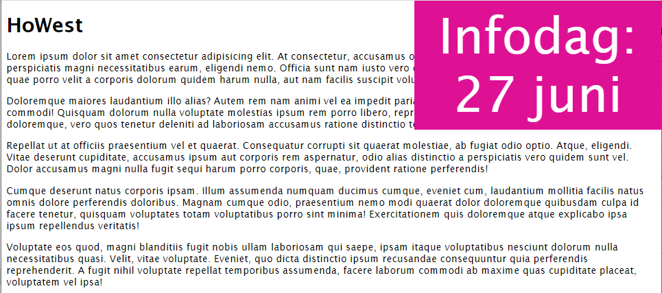
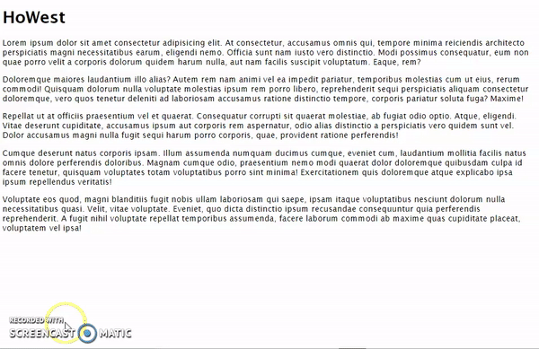

# Animatie: infodag
Maak een webpagina en een css-bestand aan en vul die met de tekst zoals in de screenshot.

Een tekst via animatie nu en dan doen verschijnen en verdwijnen, met daarnaast een kleurverandering.
Op een webpagina verschijnt om de 10 seconden een tekst, die ongeveer 2 seconden zichtbaar blijft.
Daarna verdwijnt hij volledig gedurende een viertal seconden.
Als er gescrolled wordt, blijft de animatie in de rechterbovenhoek verschijnen en verdwijnen.

